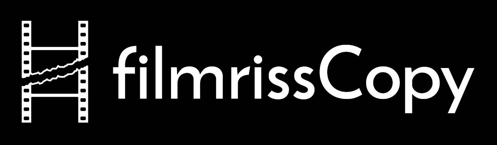

# Filmriss Copy Version 0.2

## About
FilmrissCopy is a program for copying and verifying video / audio files for onset backups.

You have the option to select multiple sources and destinations and the copied data will be verified via xxHash Checksums (or optionally SHA-1 / MD5 / Size Comparison). In case the copy process was interrupted there is the option to use RSYNC to copy the missing files.

## Logging
Comprehensive Logfiles for the completed process are stored in the destination folder as well as in a "filmrisscopy_logs" folder where the script is located. The log file can also be used to verify copys of the data later.

## Output
The created folder structure looks like this:  
.../PROJECT/SHOOTINGDAY_DATE/SHOOTINGDAY_DATE_PROJECT_REELNAME/SOURCEFOLDER/DATA... 
.../PROJECT/SHOOTINGDAY_DATE/SHOOTINGDAY_DATE_PROJECT_REELNAME/SOURCEFOLDER/CURRENTDATE_CURRENTTIME_PROJECTNAME_REELNAME_(COPYNUM)_filmrisscopy_log.txt 

V0.2 Changelog
Added Option to verify using FilmrissCopy Log Files
Fixed RSYNC Behaviour & Speed Improvements
Added Way to differentiate between Current Date/Time and Project Date
Fixed Log File Formatting Issues
Updated Folder / Log File Naming Scheme
Added Option to save preset when something is interrupted
Fixed Checksum Progress Bar
Stability Improvements
